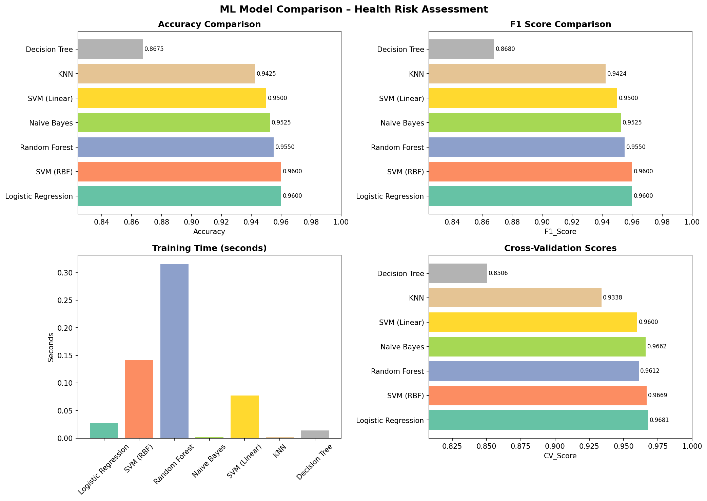
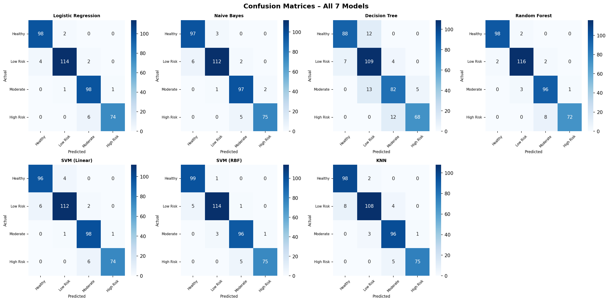

# Smart Health Risk Assessment System

> ML-powered chronic disease risk prediction using 7 machine learning algorithms

**Student:** Abhishek Kumar  
**Roll Number:** CSJMA23001390288  
**University:** CSJMU Kanpur  
**GitHub:** [@abhkpr](https://github.com/abhkpr)

---

## Overview

The Smart Health Risk Assessment System predicts a patient's chronic disease risk level (Healthy / Low / Moderate / High) from 15 clinical and lifestyle features. It trains 7 scikit-learn classifiers on a 2,000-record synthetic dataset and exposes predictions via a Flask REST API consumed by a Next.js + Tailwind frontend.

**Problem statement:** India has 77 million diabetics and 54 million CVD patients. Early risk stratification — especially in tier-2/3 cities with limited specialist access — can dramatically improve outcomes and reduce healthcare costs.

---

## Live Demo

| Service    | URL |
|------------|-----|
| Frontend   | https://health-risk-ml.vercel.app *(deploy to fill)* |
| Backend API | https://health-risk-ml-backend.onrender.com *(deploy to fill)* |
| GitHub     | https://github.com/abhkpr/health-risk-ml-project |

---

## Features

- 7 ML classifiers trained and benchmarked side-by-side
- 4-class risk prediction: Healthy · Low Risk · Moderate Risk · High Risk
- Confidence scores and per-class probability breakdown
- Personalised recommendations for each risk level
- RESTful Flask API with CORS support, ready for production (gunicorn + Render)
- Responsive Next.js / Tailwind frontend with sample patient loaders

---

## Algorithm Comparison

| Algorithm           | Accuracy | Precision | Recall | F1 Score | CV Score | Train Time |
|---------------------|----------|-----------|--------|----------|----------|------------|
| Logistic Regression | 96.00%   | 96.10%    | 96.00% | 96.00%   | 96.81%   | 0.027 s    |
| SVM (RBF)           | 96.00%   | 96.05%    | 96.00% | 96.00%   | 96.69%   | 0.141 s    |
| **Random Forest** ✓ | **95.50%** | **95.63%** | **95.50%** | **95.50%** | **96.12%** | 0.316 s |
| Naive Bayes         | 95.25%   | 95.31%    | 95.25% | 95.25%   | 96.62%   | 0.002 s    |
| SVM (Linear)        | 95.00%   | 95.09%    | 95.00% | 95.00%   | 96.00%   | 0.077 s    |
| KNN                 | 94.25%   | 94.38%    | 94.25% | 94.24%   | 93.38%   | 0.002 s    |
| Decision Tree       | 86.75%   | 87.11%    | 86.75% | 86.80%   | 85.06%   | 0.014 s    |

Random Forest selected as the deployment model for its balance of accuracy, interpretability (feature importance), and robustness to overfitting.

---

## Dataset

| Property      | Value |
|---------------|-------|
| Records       | 2,000 synthetic patients |
| Features      | 15 clinical & lifestyle |
| Classes       | 4 (Healthy / Low / Moderate / High Risk) |
| Train / Test  | 80% / 20% stratified split |
| Scaler        | StandardScaler |

**Features:** age, gender, BMI, systolic BP, diastolic BP, fasting blood sugar, HbA1c, total cholesterol, LDL, HDL, heart rate, smoking, alcohol, physical activity, family history

---

## Tech Stack

| Layer      | Technology |
|------------|------------|
| ML         | Python 3, scikit-learn 1.4, pandas, numpy |
| Visualisation | matplotlib, seaborn |
| Backend    | Flask 3.0, flask-cors, gunicorn |
| Frontend   | Next.js 15, TypeScript, Tailwind CSS |
| Deployment | Render (backend) + Vercel (frontend) |
| Version Control | Git + GitHub |

---

## Quick Start

### Backend

```bash
cd backend
python -m venv venv && source venv/bin/activate
pip install -r requirements.txt
python generate_dataset.py
python train_models.py
python app.py          # http://localhost:5000
```

### Frontend

```bash
cd frontend
npm install
# edit .env.local → NEXT_PUBLIC_API_URL=http://localhost:5000
npm run dev            # http://localhost:3000
```

---

## API Reference

### `GET /health`
Returns model status and feature list.

### `POST /predict`
**Body (JSON):** all 15 feature keys  
**Response:**
```json
{
  "risk_level": "High Risk",
  "risk_code": 3,
  "confidence": 60.0,
  "color": "#ef4444",
  "recommendations": ["URGENT: Please see your doctor immediately.", "..."],
  "probabilities": { "Healthy": 0.0, "Low Risk": 0.0, "Moderate Risk": 40.0, "High Risk": 60.0 }
}
```

---

## Project Structure

```
health-risk-ml-project/
├── backend/
│   ├── models/               # Saved .pkl files (git-ignored)
│   ├── app.py                # Flask REST API
│   ├── train_models.py       # Train & evaluate all 7 models
│   ├── generate_dataset.py   # Synthetic dataset generator
│   ├── requirements.txt
│   └── Procfile              # Render deployment
├── frontend/
│   └── app/
│       └── page.tsx          # Main form + results UI
├── screenshots/              # Visualisations and app screenshots
└── README.md
```

---

## Results

### Model Comparison Charts


### Confusion Matrices


---

## Deployment

### Render (Backend)
1. Push repo to GitHub
2. New Web Service → connect repo → Root Directory: `backend`
3. Build: `pip install -r requirements.txt` · Start: `gunicorn app:app`
4. Region: Singapore (closest to India)

### Vercel (Frontend)
1. Import GitHub repo → Root Directory: `frontend`
2. Add env var `NEXT_PUBLIC_API_URL=https://<your-render-url>.onrender.com`
3. Deploy

---

## Future Scope

- Integrate real EHR datasets (MIMIC-III / NPHCE India)
- Deep learning models (LSTM for longitudinal patient data)
- React Native mobile app
- Doctor dashboard with patient history
- Federated learning for privacy-preserving hospital collaboration

---

## References

1. WHO Global Health Estimates 2019
2. Indian Council of Medical Research – INDIAB Study
3. Scikit-learn: Machine Learning in Python, Pedregosa et al., JMLR 2011
4. Flask Documentation – https://flask.palletsprojects.com
5. Next.js Documentation – https://nextjs.org/docs

---

## License

MIT License – see [LICENSE](LICENSE)
